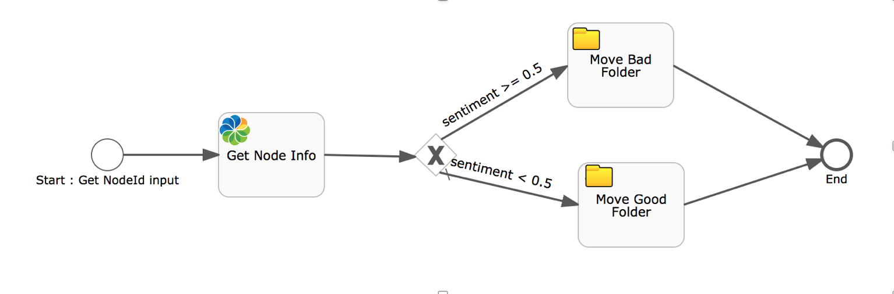

# Integrate cognitive services with ADF framework

Please note that this application is not an official product, but a testing and demo application to showcase complex interactions for ADF components.

## Installing

To correctly use this demo check that on your machine is running [Node](https://nodejs.org/en/) version 5.x.x or higher.

## Proxy settings and CORS

To simplify development and reduce the time to get started the application features the following Proxy settings:

- **http://localhost:3000/ecm** is mapped to **http://localhost:8080**
- **http://localhost:3000/bpm** is mapped to **http://localhost:9999**

The settings above address most common scenarios for running ACS on port 8080 and APS on port 9999 and allow you to skip the CORS configuration.

If you would like to change default proxy settings, please edit the `config/webpack.common.js` file.

## Application settings (server-side)

All server-side application settings are stored in the `app.config-dev.json` and `app.config-prod.json` files. 
By default the configuration files have the content similar to the following one:

```json
{
    "ecmHost": "http://localhost:3000/ecm",
    "bpmHost": "http://localhost:3000/bpm"
}
```

## How to start the project 

In order to correct import the app and configure the process service and the content service you can refer to [this article](https://community.alfresco.com/people/eugenio_romano/blog/2017/07/04/move-content-service-file-in-a-folder-with-the-process-service)

### Register and create an account to use the cognitive services

Register on the microsoft website and create two kye for:

- Computer vision API
- Sentiment analysis API

Once you have your keys replace them in the app.config-prod.json:

```javascript
{
    "ecmHost": "http://{hostname}:{port}/ecm",
    "bpmHost": "http://{hostname}:{port}/bpm",
    "application": {
        "name": "Integration ADF cognitive service between CS and PS"
    },
    "keySentiment": "YOUR_KEY_SENTIMENT",
    "keyVision": "YOUR_KEY_VISION"
}

```

### Configure Process Service app 

The first step that you need to do to make this project works is to install the [sentiment-app at this link](process-app/sentimen-app.zip).

          
               
Configure the content service endpoint as explained [here](https://community.alfresco.com/people/eugenio_romano/blog/2017/07/04/move-content-service-file-in-a-folder-with-the-process-service)
 

### Configure Content Service Metadata

```sh
npm start
```


