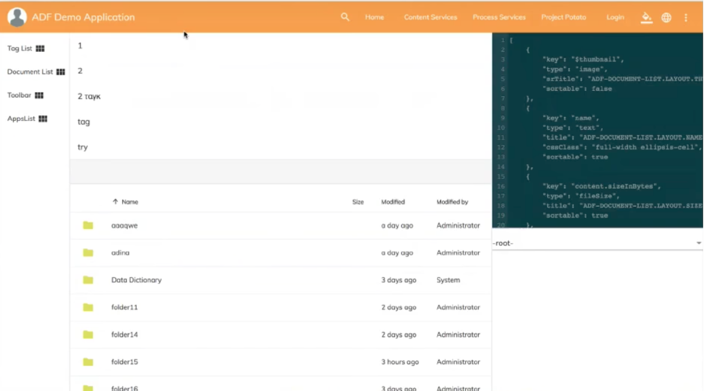

# RAD ADF hackathon

This project has been created during the 24 hours Alfresco hackathon.

## Prerequisites

Before you start using this development framework, make sure you have installed all required software and done all the
necessary configuration, see this [page](https://github.com/Alfresco/alfresco-ng2-components/blob/master/PREREQUISITES.md).

## Building and Running

Install dependencies

```sh
npm install
```

## Start the project

```sh
npm start
```




This command compiles and starts the project in watch mode.
Browser will automatically reload upon changes.
Upon start you can navigate to `http://localhost:3000` with your preferred browser.

#### Important notes

  
